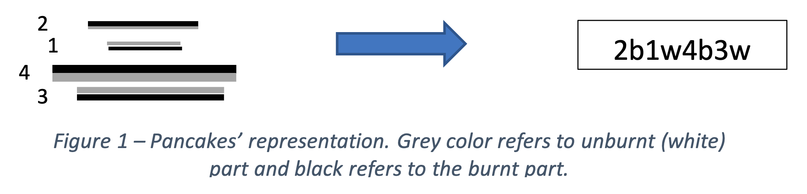

# Homework 1 Burnt pancake problem

## In Short

Write a program that receives an order of 4 bottom-burnt pancakes and prints the solution that BFS and A\* search will find for going from the Start state to the Goal (ordered pancakes and all burnt-side down).

## Description

In this programming homework, you will work on a modified version of the classic pancake problem that was discussed in class. In this version, one side of each pancake is burnt, and the pancakes must be sorted with all the burnt-side down. You need to write a program that receives an arbitrary order of such 4 pancakes from the user, plus the type of the search algorithm, and prints the steps that the specified algorithm will take to reach the Goal state.

## Format

Similar to the format described in class, each of the pancakes has an ID number that is consistent with their size followed by a letter “w” or “b”. This way, the largest pancake has an ID of 4, the next largest 3, the next 2, and the smallest has an ID of 1. The letter “w” refers to the unburnt (white) side being up, and “b” shows that the burnt side is up. The goal is to reach “1w2w3w4w”. Figure 1 shows an example of the IDs associated with each pancake in a certain configuration.



## Input

The input should consist of pairs of four digits and one character, a hyphen, and one last character (#C#C#C#C-X), where the first digit indicates the ID of the top pancake and the first character indicates whether the burnt side is down (“w”) or not (“b”), the second number indicates the second-highest pancake followed by a character, etc. The last character (X) would be “b” or “a” characters, which refer to the Breadth-First (BFS) or A\* search algorithms respectively. The program should receive this variable as input from the user upon running the code.

## Implementation

The cost associated with each flip is equal to the number of pancakes that are being flipped. For instance, the cost of one flip between pancake 3b and 2w from the state “4w1b2w3b” to “2b1w4b3b” is equal to 3 (spatula between 2 and 3). For each state, use the same heuristic function (h(x)) that was discussed in the class: “the ID of the largest pancake that is still out of place”. For BFS, you don’t need to consider a cost and a heuristic function. Use the graph version of the algorithms, meaning that use some type of list (closed set) to avoid visiting the nodes multiple times.
Add clear comments as you can to your code, so that it’s easy to understand your implementation, including the role of functions, variables, etc. Specifically, make it clear how your fringe is implemented and employed. Use an informative name for your fringe and add comments where you define that.

## Tie-Breaking

When needed for any of the search algorithms, use the following tie-breaking mechanism:
"when there is a tie between two nodes, replace “w” with 1 and “b” with 0 to obtain an eight-digit number. After that pick the node with a larger numerical ID chosen."
For instance, if there is a tie between 4b3w2b1b and 3w4w2b1b, then 4b3w2b1b will be chosen as 40312010>31412010.

## Output

Your program must print the steps that the specified algorithm (e.g., BFS) finds to solve the problem, line by line. In other words, simply prints the solution that the algorithm finds. For each state (except the final state), use the character “|” to show where the flip to go to the next step happens. For A\*, also print the value for the actual cost (function g), and the value of the heuristic function (function h) in each step. The following is an example of an input and output of the program.

```
Input:
1b2b3w4b-a # “a” indicates A\*

Output: 1b2b|3w4b g:0, h:0
2w|1w3w4b g:2, h:2
2b1w3w4b| g:3, h:2
4w|3b1b2w g:7, h:4
4b3b1b2w| g:8, h:4
2b1w|3w4w g:12, h:2
1b|2w3w4w g:14, h:0
1w2w3w4w g:15, h:0
```

Note that the values for g and h correspond to the “current” state, and the character “|” denotes the location of the flip for going to the “next” state.

## Some Other Examples

```
Example 1
Input: 1w2b3w4b-a

Output: 1w2b|3w4b g:0, h:0
2w|1b3w4b g:2, h:2
2b1b3w4b| g:3, h:2
4w|3b1w2w g:7, h:4
4b3b1w2w| g:8, h:4
2b1b|3w4w g:12, h:2
1w2w3w4w g:14, h:0

Example 2
Input: 1w2b3w4b-b

Output: 1w2b|3w4b
2w|1b3w4b
2b1b|3w4b
1w2w3w4b|
4w|3b2b1b
4b3b2b1b|
1w2w3w4w

Example 3
Input: 1b2b3w4b-a

Output: 1b2b|3w4b g:0, h:0
2w|1w3w4b g:2, h:2
2b1w3w4b| g:3, h:2
4w|3b1b2w g:7, h:4
4b3b1b2w| g:8, h:4
2b1w|3w4w g:12, h:2
1b|2w3w4w g:14, h:0
1w2w3w4w g:15, h:0

Example 4
Input: 1w2b3b4w-b

Output: 1w2b|3b4w
2w|1b3b4w
2b1b|3b4w
1w2w3b|4w
3w|2b1b4w
3b2b1b|4w
1w2w3w4w

Example 5
Input: 1b2w3b4b-a

Output: 1b2w3b4b| g:0, h:0
4w|3w2b1w g:4, h:4
4b3w|2b1w g:5, h:4
3b|4w2b1w g:7, h:4
3w4w|2b1w g:8, h:4
4b3b2b1w| g:10, h:4
1b|2w3w4w g:14, h:0
1w2w3w4w g:15, h:0
```
