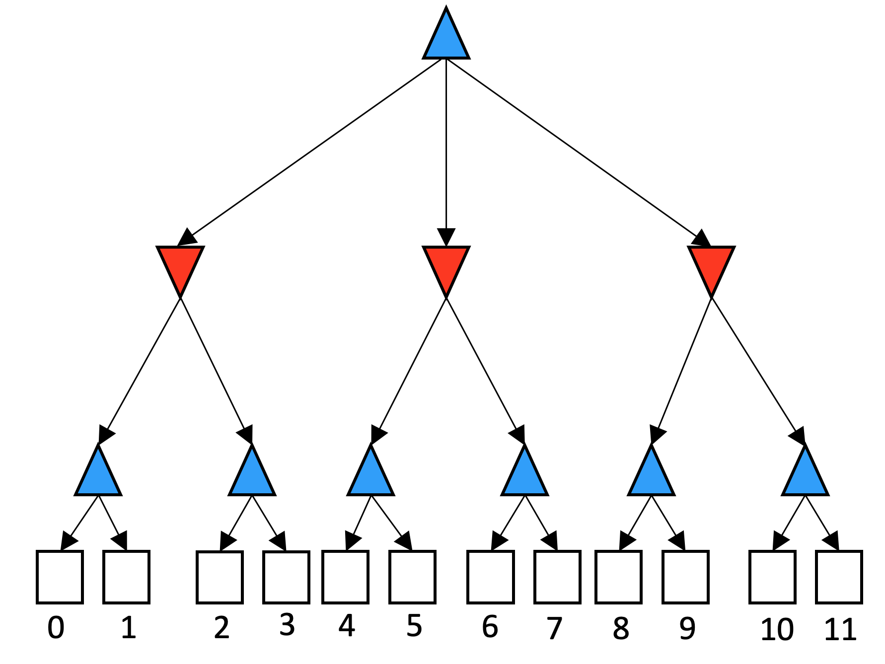

# Homework 2 Alpha-beta search

## Description

In this homework, you will work on the same alpha-beta search problem that we have solved in class. The slide also had a youtube link for you to watch the complete solution for the example search tree. The tree structure is fixed and is shown in the figure below. You need to write a program that receives 12 numbers separated by space from the user. The 12 input numbers will correspond to the 12 terminal nodes of the tree from left to right. Your program should print the index of the terminal states that will be pruned using the alpha-beta search algorithm. The indexes are fixed and are shown in the figure below (0 to 11). As an example case, if the fourth blue triangle from the left should be pruned, your program must print: “6 7” referring to the two terminal nodes below that node.


## Example input-output pairs

```
Example 1
Input:
2 4 13 11 1 3 3 7 3 3 2 2
Output:
3 6 7 10 11

Example 2
Input:
1 4 2 6 8 7 3 7 2 3 2 2
Output:
10 11

Example 3
Input:
15 4 12 16 10 7 3 1 2 3 2 2
Output:
6 7 10 11

Example 4
Input:
1 4 12 16 1 7 3 1 2 8 2 2
Output:
3

Example 5
Input:
1 4 12 16 1 7 3 1 2 8 10 2
Output:
3 11
```
