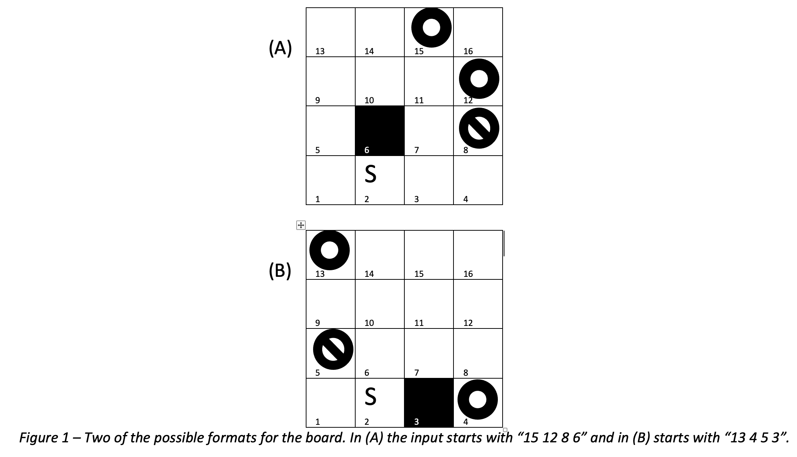
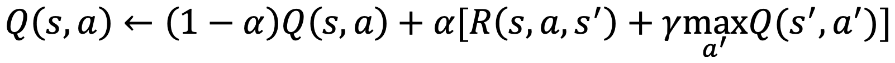

# Homework 3 Q-learning

## Description

In this programming homework, you will write a program that uses the Q-learning algorithm to determine the best path to a goal state.

## Format

Similar to the format described in the class, you will work with a 4\*4 board. Each of the 16 squares has a unique index, as shown in the corner left of the two example boards in Figure 1. There are five special squares on the board. These five squares are the start, goal, forbidden, and wall squares. The remaining 11 squares are empty and ordinary squares. The starting square (shown with the letter S) is fixed and always at square 2. The location of the two goals, forbidden, and wall squares are determined from the input. An agent has four possible actions, going to the north, east, south, and west. The board is bounded from the sides.

## Input

The input to your program consists of four numbers, one character, and possibly an additional number [# # # X (#)]. The first four numbers show the location of the two goals, forbidden, and wall squares respectively. Figure 1 shows two possible inputs and the corresponding board configuration based on each of those inputs. The remaining items in the input, determine the output format. The fourth item is either character “p” or “q”, and if it’s “q”, there will be an additional number at the end. Item “p” refers to printing the optimal policy (Π*), and “q” refers to the optimal Q-values (Q*). You can assume that the five special squares are distinct (non-overlapping).

## Implementation

You should use Q-learning to calculate the best action for each square to reach the goal square. In the beginning, all of the Q-values are set to zero. The (hypothetical) agent should start from the S square. The agent iteratively updates the Q-values for each state, by following the main formula discussed in the class:

In this problem, the living reward for every action (each step) is r=-0.1. The discount rate is γ = 0.1, and the learning rate is α = 0.3. The reward for performing the exit action (the only available action) in both goal squares is +100, and for the forbidden square is -100. The agent cannot enter or pass through the wall square. After hitting the wall, the agent’s position will not be updated. It will remain in the same square and will keep getting a -0.1 reward every time it hits the wall. For the purpose of exploring the board, use an ε-greedy method with ε = 0.5. This means that with the probability ε, the agent acts randomly, and with the probability 1-ε, it acts on current policy. In order to have a similar random value use 1 as the seed value of your random function.

## Convergence

If needed, you can also set the maximum number of iterations to 100,000. After that, you can set ε= 0.

Output
If the input contains “p”, your program has to print the best action that should be chosen for each square or in other words print Π\*. To do this, in separate lines print each state’s index and the action. Here is an example:
Input:
15 12 8 6 p
Output:
1 up
2 right
3 up
4 left
5 up
6 wall-square
7 up
8 forbid
9 up
10 up
11 up
12 goal
13 right
14 right
15 goal
16 up

If the input contains “q” following a number n, the program has to print the four Q-values associated with each of the four possible actions in the state that has an index n. Here is an example:
Input: 15 12 8 6 q 11
Output:
up 100.0
right 100.0
down 0.89
left 0.89

## Tie-Breaking

In some situations, there might be similar q-values for different actions in the final stage when the final policy needs to be printed. For example:
Input: 15 12 8 6 q 11
Output:
up 100.0
right 100.0
down 0.89
left 0.89

where two similar maximum q-values for the up and right actions are available. In these situations, use a clockwise priority for printing the final policy (i.e., up, right, down, left).

## Additional examples

Input:10 8 9 6 p
output:
1 right
2 right
3 up
4 up
5 down
6 wall-square
7 right
8 goal
9 forbid
10 goal
11 left
12 down
13 right
14 down
15 down
16 down

input:10 8 9 6 q 2
output:
up -0.01
right 0.89
down -0.01
left -0.1

        	input:12 7 5 6 p
        	output:
                    	1	right

2 right
3 up
4 up
5 forbid
6 wall-square
7 goal
8 up
9 up
10 up
11 up
12 goal
13 up
14 up
15 up
16 up

        	input:12 7 5 6 q 3
        	output:

up 100.0
right 0.89
down 9.9
left 0.89

Input: 13 11 16 5 p
Output:
1 right
2 up
3 up
4 up
5 wall-square
6 up
7 up
8 up
9 up
10 right
11 goal
12 left
13 goal
14 left
15 down
16 forbid

Input:
13 11 7 15 p
Output:
1 up
2 up
3 right
4 up
5 up
6 up
7 forbid
8 up
9 up
10 right
11 goal
12 left
13 goal
14 left
15 wall-square
16 down
